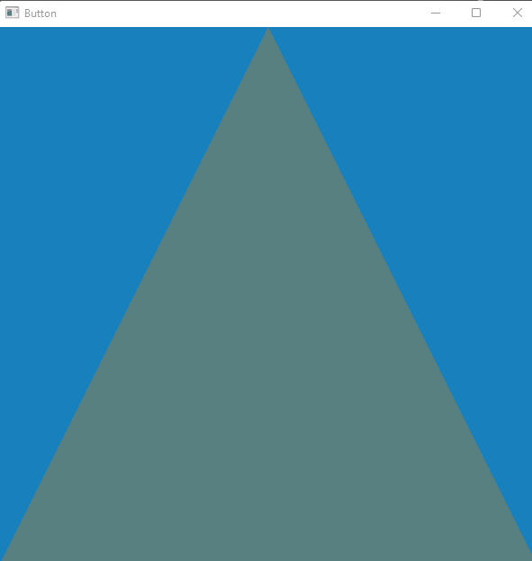

# opengl_challenges
my opengl personal challenges library

# challenge 1 (sort analyzer)
opengl generic sort analyzer 

# challenge 2 (custom analyzer)
opengl forward & back sort analyzer
(utilizes key stroke callback functionality)

# challenge 3 (simple button)
opengl generic button with action
(utilizes mouse press callback functionality)

